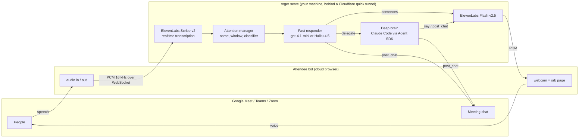

<h1 align="center">Roger</h1>

<p align="center">
  A voice AI teammate that joins your Google Meet, Microsoft Teams and Zoom calls.<br>
  It listens, answers when spoken to, talks in a natural ElevenLabs voice, posts code and links to the meeting chat,<br>
  and can think with the full context of one of your Claude Code sessions.
</p>

<p align="center">
  <a href="LICENSE"></a>
  
  
</p>

```bash
roger run https://meet.google.com/xxx-xxxx-xxx
```

Roger shows up in the meeting as a participant with an animated orb for a webcam, says hello, and waits.
Say its name and ask something; it answers out loud about a second later. Keep talking to it without repeating
the name. Talk over it and it stops. Ask for code or a link and it appears in the chat.

## What it does

- **Joins real meetings** on Google Meet, Microsoft Teams and Zoom through the [Attendee](https://attendee.dev) meeting-bot API. No browser extension, no fake microphone on your laptop.
- **Hears and speaks with ElevenLabs.** Scribe v2 Realtime for transcription, Flash v2.5 for the voice. Any voice from your ElevenLabs library works, including cloned ones.
- **Answers in about a second.** A small streaming model (OpenAI `gpt-4.1-mini` or Claude Haiku 4.5) speaks sentence by sentence as it is generated, so the first word lands roughly one second after the question ends.
- **Thinks deeper when it has to.** Hard questions are handed to Claude Code through the Agent SDK: your own session, forked, with read-only access to the repository. Roger says "let me pull that up", the deep brain reads the code, and the answer comes back spoken, with details posted in chat.
- **Knows when it is being talked to.** Saying its name always works. After that, a conversation window stays open and a fast classifier decides for each utterance whether it is for Roger, for someone else, or just people talking. "Thanks Roger" closes the window. "Roger, mute" silences it until the name is used again.
- **Attributes speech to people.** Per-participant audio energy tells Roger who is talking, so the transcript and the classifier see names rather than "Someone".
- **Behaves in a room.** Barge-in stops it mid-sentence. It filters out its own voice coming back through the meeting. It never speaks markdown, and it puts lists, code and URLs in chat instead of reading them.
- **Looks the part.** Its webcam is the open-source [ElevenLabs UI orb](https://github.com/elevenlabs/ui) (MIT), reacting to its own voice and to the room. Colors and size are settings.

## How it works



**Two brains, one voice.** The fast responder answers from a *briefing* (written by the deep brain at start when one is attached) plus the last few minutes of transcript. When it decides a question needs the repository, tools or more certainty, it calls `delegate` instead of guessing. Roger immediately plays a pre-rendered bridge phrase in its own voice, the deep brain works for a few seconds, then speaks a short answer and posts the details.

**Gate release, not generation.** While a conversation window is open, every utterance starts an answer *and* a classifier call in parallel. Audio is only released if the classifier says the utterance was for Roger. On the happy path the classifier costs no latency; on the unhappy path the draft is thrown away.

The full design, with latency budgets and the reasoning behind each choice, is in [docs/ARCHITECTURE.md](docs/ARCHITECTURE.md).

## Quick start

### 1. Prerequisites

- Python 3.11 or newer.
- [`cloudflared`](https://developers.cloudflare.com/cloudflare-one/connections/connect-networks/downloads/) for a free public URL (`brew install cloudflared` on macOS). No Cloudflare account is needed. Skip it if you already have a public HTTPS URL that reaches your machine.
- Three accounts, all with personal sign-up:

| Service | What it is for | Where to get the key |
|---|---|---|
| [Attendee](https://app.attendee.dev) | the participant that joins the meeting | sign up, then *Settings > API keys*. Free hours to start, hourly after that |
| [ElevenLabs](https://elevenlabs.io) | hearing (Scribe v2 Realtime) and voice (Flash v2.5) | profile > *API keys*. A paid plan is recommended; the free tier runs out of characters quickly |
| [OpenAI](https://platform.openai.com) **or** [Anthropic](https://console.anthropic.com) | the fast spoken replies and the "is this for me?" classifier | API keys page. One of the two is enough |

### 2. Install

```bash
git clone https://github.com/nitish20899/roger.git
cd roger
python3 -m venv .venv && source .venv/bin/activate
pip install .
cp .env.example .env
```

Or, with make: `make setup`. To hack on Roger itself use an editable install (`pip install -e .` or `make dev`) so
edits apply without reinstalling; after `git pull` on a plain install, run `pip install .` again.

### 3. Configure

Open `.env` and paste your three keys. Everything else is optional and documented inline in [`.env.example`](.env.example). The most common tweaks:

```bash
BOT_NAME=Roger                 # what people see and say
OWNER_NAME=Alice               # "Hi, I'm Roger, Alice's AI assistant"
ELEVENLABS_VOICE_ID=...        # any voice from your library
```

Then check everything:

```bash
roger doctor
```

### 4. Join a meeting

```bash
roger run https://meet.google.com/xxx-xxxx-xxx
```

Roger starts the server, opens a tunnel, creates the bot and asks to join. If the meeting has a waiting room, admit
"Roger" when the prompt appears. It greets the room, drops one line in the chat, and listens. Press `Ctrl-C` to make it
leave.

To bring the context of the Claude Code session you are working in, add the project folder and let Roger pick the
newest session for it (see [Attach your Claude Code session](#attach-your-claude-code-session-the-deep-brain)):

```bash
roger run https://meet.google.com/xxx-xxxx-xxx --session latest --project ~/code/my-project
```

Teams and Zoom links work the same way; see [Platform notes](#platform-notes) for the differences.

## Platform notes

| | Google Meet | Microsoft Teams | Zoom |
|---|---|---|---|
| Join | guest; admit it from the "someone wants to join" prompt | guest; the organizer admits it from the lobby | needs Zoom app credentials in your Attendee account ([docs](https://docs.attendee.dev)) |
| Link | `https://meet.google.com/xxx-xxxx-xxx` | the link from the invite. If Attendee rejects a short `teams.microsoft.com/meet/...` link, use the long `teams.microsoft.com/l/meetup-join/...` one from "Join the meeting now" | the invite link with its passcode |
| Who is talking | per-participant audio, so the transcript has names | Teams exposes one mixed stream, so speakers show as "Someone"; everything else works (wake word, follow-ups, chat) | per-participant audio |
| Chat, orb webcam, voice | yes | yes; if the tenant blocks the webcam page Roger falls back to plain audio | yes |

Company tenants often restrict guests. If the bot never leaves `waiting_room`, ask the organizer to admit it. For tenants
that refuse guests entirely, create a signed-in bot account in Attendee (Settings > Bot Logins) and set
`ATTENDEE_USE_LOGIN=1` (and `ATTENDEE_LOGIN_GROUP` if you have several); Roger then joins Teams and Meet with that account.

## Talking to Roger

| You say | Roger does |
|---|---|
| "Roger, what did we decide about the vendor?" | answers out loud in one to three sentences |
| "And what does it cost?" (no name, within 30 s) | still answers: the conversation window is open |
| "Bob, can you check the firewall?" | stays quiet: the classifier sees the question is for Bob |
| "Roger, show me the query." | says a bridge phrase, the deep brain reads the code, answers, posts the query in chat |
| anything, while Roger is talking | Roger stops mid-sentence |
| "Thanks Roger." / "Let's move on." | closes the conversation window |
| "Roger, mute." | stays silent until someone says its name again |

The window also closes by itself after three utterances that were not for Roger, or after 30 s (`ATTENTION_WINDOW_S`).

## Attach your Claude Code session (the deep brain)

This is what makes Roger more than a voice for a chatbot. Attach the Claude Code session you have been working in and
Roger knows the project, the decisions and the open questions from that session.

```bash
roger sessions ~/code/my-project        # lists sessions, newest first
```

Then either pass it on the command line:

```bash
roger run https://meet.google.com/xxx-xxxx-xxx --session 9ad00b4f-690b-4ce6-afe2-946065e874e3 --project ~/code/my-project
roger run https://meet.google.com/xxx-xxxx-xxx --session latest --project ~/code/my-project   # newest session for that project
```

or make it the default in `.env`:

```bash
CLAUDE_SESSION_ID=9ad00b4f-690b-4ce6-afe2-946065e874e3
PROJECT_DIR=~/code/my-project
```

Tip: while working in Claude Code, `/status` shows the id of the session you are in.

On start, the session is **forked** (your original is untouched) and asked to write a briefing; the fast responder
answers from that briefing. Questions that need the repository are delegated to the fork, which may read, grep and
glob but cannot edit files, push or run anything. The briefing is cached in `~/.roger` for six hours.

Without a session id but with `PROJECT_DIR` set, Roger starts a fresh read-only Claude Code session in that folder and
briefs itself from the repository.

Authentication: by default the deep brain uses your existing Claude Code login (`DEEP_AUTH=subscription`). Set
`DEEP_AUTH=api` to bill `ANTHROPIC_API_KEY` instead. The model is `DEEP_MODEL` (default `sonnet`).

The fork runs with the project's own Claude Code settings (`.claude/settings.json` and `settings.local.json` in
`PROJECT_DIR`), so a project that routes Claude Code through Bedrock, Vertex or a Databricks gateway keeps doing so in
the meeting. Keep `DEEP_MODEL` an alias (`sonnet`, `opus`) in that case, because it is mapped through the project's
`ANTHROPIC_DEFAULT_*_MODEL` settings. Very long sessions are compacted before the first answer; run `/compact` in the
session beforehand to make the start faster.

## Commands

| Command | What it does |
|---|---|
| `roger run <url>` | server + tunnel + join; leaves the meeting on `Ctrl-C` |
| `roger serve` | server + tunnel only. The bot survives restarts of this process and reconnects |
| `--session ID` / `--session latest`, `--project DIR` | options of `run` and `serve`: attach a Claude Code session (or the newest one for the project) as the deep brain. They override `CLAUDE_SESSION_ID` and `PROJECT_DIR` from `.env` |
| `roger join <url>` / `roger leave` | control the bot while `roger serve` is running |
| `roger say "text"` | make it say something |
| `roger ask "Roger, ..."` | simulate someone talking to it, no meeting needed |
| `roger status` | health of the running server as JSON |
| `roger sessions [dir]` | list Claude Code sessions for a project |
| `roger doctor` | check keys, tools and configuration |

While it runs: `http://localhost:8787/monitor` shows its state and plays what it says, `/health` is the JSON status,
`/decisions` lists the last 50 attention decisions with reasons, and `~/.roger/roger.log` has every heard utterance,
reply and per-answer latency.

## Configuration

Everything is an environment variable, normally set in `.env`. [`.env.example`](.env.example) documents all of them.
Precedence is command-line flags (`--session`, `--project`), then variables already in your shell, then `.env`.
The `.env` file is looked up in the current directory, then the repository root, then `~/.roger/.env`; keep it in
`~/.roger` to run `roger` from any directory, or pass `--env FILE`.
The ones that change behaviour most:

| Variable | Default | Meaning |
|---|---|---|
| `BOT_NAME` | `Roger` | display name in the meeting; the first word is the wake word |
| `WAKE_WORDS` | name + known mishearings | how the transcriber tends to hear the name |
| `OWNER_NAME` | empty | who it introduces itself as assisting |
| `FAST_PROVIDER` | `openai` if you have that key | `openai` or `anthropic` for the voice path |
| `FAST_MODEL` | `gpt-4.1-mini` / `claude-haiku-4-5` | the fast responder |
| `CLASSIFIER_MODEL` | `gpt-4.1-mini` / `claude-haiku-4-5` | the "is this for me?" classifier |
| `ELEVENLABS_VOICE_ID` | George | the voice |
| `STT_SILENCE_S` | `0.6` | silence that ends someone's turn; lower is snappier but cuts people off |
| `ATTENTION_WINDOW_S` | `30` | how long follow-ups need no name |
| `ORB_COLORS`, `ORB_BG`, `ORB_SIZE` | warm on dark, 520 px | the orb's look; changes apply on restart without rejoining |
| `CLAUDE_SESSION_ID`, `PROJECT_DIR` | empty | the deep brain |
| `PUBLIC_URL` | empty | set it to skip the Cloudflare quick tunnel |

## The orb

Roger's webcam is a web page rendered by Attendee in the bot's browser. That page plays Roger's voice (so audio and
video are in sync) and draws the ElevenLabs UI orb, fed with Roger's output level and the room's input level.
The built page ships in `roger/static/orb`, so you do not need Node to run Roger. To change the React source in
[`orb/`](orb/) and rebuild:

```bash
make orb          # needs Node 18+
```

Without the built page Roger falls back to a small WebGL shader orb with the same behaviour.

## Testing without a meeting

```bash
roger serve                                            # in one terminal
open http://localhost:8787/monitor                     # hear what it says
curl -s localhost:8787/test/tone                       # a 440 Hz tone: audio path, no keys needed
roger ask "Roger, in one sentence, what can you do?"   # full hear -> think -> speak path
python -m pytest                                       # offline tests of the attention state machine and text utilities
python scripts/eval_attention.py                       # scores the live classifier on 24 labeled snippets
AUDIO_OUT=ws roger serve && python scripts/loop_test.py   # pretends to be the meeting bot end to end, reports latency
```

## What to expect

- **Latency.** End of question to first spoken word is about 1.0 to 1.5 s on the fast path through the hosted bot. Delegated answers take 10 to 40 s, covered by the bridge phrase. Each answer's timing is logged as `latency: question committed -> first audio out`.
- **Classifier accuracy.** 23 of 24 on the bundled labeled snippets with `gpt-4.1-mini` and with `gpt-5.4-mini`.
- **Cost.** Roughly, per meeting hour: Attendee about $0.50, ElevenLabs a few dollars of characters when Roger talks a lot, the fast model cents, and the deep brain whatever Claude Code costs for a dozen questions. Check current prices with each vendor.
- **Waiting rooms.** Google Meet may hold guest bots for approval; admit it manually. Teams tenants often require the organizer to admit external bots too.
- **Chat is plain text.** Google Meet truncates at about 500 characters, so long code is split into several messages.

## Troubleshooting

| Symptom | Fix |
|---|---|
| `roger doctor` reports a missing key | edit `.env`; the file is loaded from the current directory, then the repo root, then `~/.roger/.env`, or pass `--env path` |
| `roger` stops working with `ModuleNotFoundError: No module named 'roger'` after an editable install on macOS | some Macs flag files inside `.venv` as hidden, and Python 3.11.14+ skips hidden `.pth` files, which is how editable installs are found. Either `chflags nohidden .venv/lib/python3.*/site-packages/*.pth`, or use a plain `pip install .` |
| "cloudflared did not report a URL" | check `cloudflared tunnel --url http://localhost:8787` by hand; or set `PUBLIC_URL` to your own public URL |
| The bot joins but never hears anything | `roger status`: `bot_audio_ws` must be true. Attendee needs to reach your public URL over `wss://` |
| It answers its own greeting | the echo filter normally handles this; leave `BARGE_IN_ENERGY=0` |
| It talks over people or answers questions meant for others | lower `ATTENTION_WINDOW_S`, or say "Roger, mute" during side discussions |
| The deep brain "could not get to its notes" | the forked session hit an error: check `~/.roger/roger.log`. Common causes: `DEEP_MODEL` needs credits on your plan, or the session id belongs to another `PROJECT_DIR` |
| Voice sounds robotic or cuts words | try another `ELEVENLABS_VOICE_ID`, raise `VOICE_STABILITY`, or increase `STT_SILENCE_S` |

## Project layout

```
roger/            the Python package
  cli.py          `roger` command
  server.py       aiohttp app: WebSockets for the bot and the pages, HTTP control endpoints
  bridge.py       orchestrator: audio in, attention, answers out
  attention.py    the "is this for me?" state machine and classifier prompt
  fast.py         fast responder (OpenAI / Anthropic), streaming with tools
  deep.py         Claude Code through the Agent SDK, with say / post_chat tools
  speaker.py      paced PCM output, barge-in, echo bookkeeping
  stt.py, tts.py  ElevenLabs Scribe and Flash clients
  attendee.py     Attendee API client
  prompts.py      every prompt and canned line
  config.py       settings from environment
  static/         monitor page, built orb page, fallback orb
orb/              React source of the orb page (ElevenLabs UI component + glue)
tests/            offline tests (pytest)
scripts/          classifier evaluation, end-to-end loop test
docs/             architecture design and research notes
```

## Roadmap

- Chat-triggered questions (`@Roger` in the meeting chat).
- Snippet links for code longer than the chat limit.
- Think-ahead: let the deep brain update the briefing from the transcript every few minutes.
- Post-meeting notes written back into the project.
- A hosted deployment recipe (one container per meeting, no tunnel).

Contributions are welcome; see [CONTRIBUTING.md](CONTRIBUTING.md).

## Acknowledgements

- [Attendee](https://github.com/attendee-labs/attendee) for an open, personal-signup meeting-bot API.
- [ElevenLabs UI](https://github.com/elevenlabs/ui) for the orb component (MIT).
- [Claude Agent SDK](https://docs.anthropic.com/en/docs/agent-sdk) for making a Claude Code session something you can hand to a meeting.

## License

MIT. See [LICENSE](LICENSE). The orb visual is adapted from ElevenLabs UI, also MIT.
