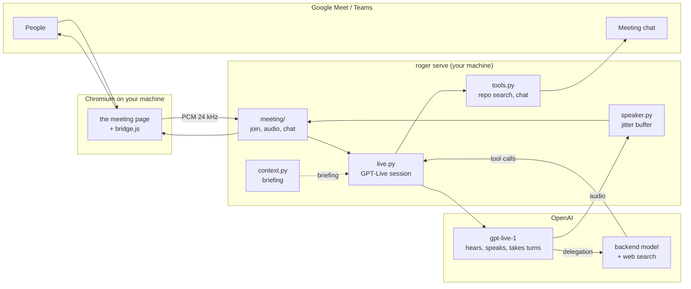

# Architecture

Roger is about 3,300 lines of Python and one page of JavaScript. This is what they do and why.

## The shape of it



Nothing in that diagram leaves your machine except the calls to OpenAI and the meeting itself.

## Getting into the call

`roger/meeting/` is a small layer with one job: be a participant. Everything above it talks to a
`MeetingClient` and subscribes to its events, and knows nothing about Google, Microsoft or browsers.

```
meeting/base.py           the interface: join, leave, send_audio, send_chat + an event bus
meeting/browser.py        a participant that is Chromium on this machine (the default)
meeting/assets/bridge.js  the page half: the fake microphone and the audio tap
meeting/platforms/        which buttons to press, per product
meeting/attendee.py       the hosted alternative, same interface, opt-in
```

The browser participant works by injecting `bridge.js` before the meeting app's own scripts. It patches
`getUserMedia` to hand out a microphone we write Roger's voice into — so the call hears an ordinary
participant — and wraps `RTCPeerConnection` to tap every inbound audio track. Microsoft Teams lists it as
*"Roger (virtual microphone)"* in its own device picker, which is the clearest sign it is working.

Two decisions there were forced by what the meeting products allow, and both cost a day to find:

**The transport is a Playwright binding, not a WebSocket.** Google Meet's Content-Security-Policy forbids
a page script from connecting to `127.0.0.1`, and the attempt does not fail politely — it takes the
renderer down, which surfaces as "Page crashed" and nothing else. A binding is installed by the driver
over the DevTools protocol, so no page policy applies to it. Audio crosses as base64 in JSON, which at ten
frames a second is nothing.

**The taps are ScriptProcessorNodes, not AudioWorklets.** A worklet's code has to be fetched as a module,
and Teams' CSP refuses both `blob:` and `data:` module URLs, so a worklet cannot be installed there at
all. ScriptProcessorNode is deprecated and is also the only thing that works in both products today.

Two AudioContexts, and the reason is a trap worth naming. **Chrome hands WebRTC a silent track from a
`MediaStreamAudioDestinationNode` whose context is not at the browser's native sample rate.** No error, in
the page or on the wire — just perfectly formed, perfectly empty audio. Roger ran at 24 kHz and was mute
in every meeting. So the outbound context runs at whatever rate the browser wants and we resample into it,
while the inbound context runs at 24 kHz, where `createMediaStreamSource` resamples for free and in better
quality than we would manage by hand. `tests/test_browser_audio.py` pins this down with a real WebRTC
loopback in a real browser, because no unit test could have caught it.

Adding a platform is a `Platform` subclass: press these buttons, read this state. Adding a *consumer* --
a recorder, a note-taker, something that watches for a keyword -- is a subscription:

```python
meeting.on(Event.AUDIO, my_handler)
```

## One session does the hard part

A voice assistant is usually a chain: transcribe, decide whose turn it is, think, synthesise speech. Every
stage adds latency and a failure mode, and turn-taking is the one nobody gets right.

[GPT-Live](https://developers.openai.com/api/docs/guides/live) collapses the chain. One WebSocket carries
audio both ways; the model listens while it speaks, so interruption is native rather than simulated with
voice-activity heuristics. `roger/live.py` is that connection and nothing else: session setup, audio
framing, transcript reassembly, the delegation protocol.

## Thinking is delegated, not chained

When the model needs a fact it does not stop talking. It raises a *delegation*, and OpenAI runs a backend
model — passing it the conversation — while the voice keeps going. The result comes back and gets spoken
in the model's own words. A ten-second lookup sounds like a colleague thinking rather than dead air.

Roger uses **Responses delegation**, where OpenAI owns that loop. The alternative, client delegation, hands
you a delegation id and nothing else: you must reconstruct the question from the transcript, and a
transcript turn often closes *after* the delegation fires, so you answer the wrong question. That bug is
structurally impossible here.

Roger's own tools arrive as `response.event` envelopes, run in-process, and return through
`response.item.create`. They can search and read files under `PROJECT_DIR`, and post to the meeting chat.
Nothing writes, runs or pushes.

## Context comes from sessions, read not run

The briefing is what makes the bot worth talking to, and it comes from the coding sessions you were
already working in. `roger/sessions.py` finds and parses them — Claude Code's
`~/.claude/projects/**/<id>.jsonl` and Codex's `~/.codex/sessions/**/rollout-*.jsonl` — and
`roger/context.py` turns them, plus the repository, into a briefing with one OpenAI call.

Neither client is ever executed. They are transcripts on disk; treating them as anything more would mean a
second vendor, a second bill, and write access to sessions you are still using.

## Audio is the fiddly part

`roger/speaker.py` exists because GPT-Live streams at real time — about a second of audio per second — and
delivery stalls for up to ~360 ms. A text-to-speech API returns a whole sentence faster than you can say
it, so the far end always had slack; here it has none, and a stall mid-word is heard as distortion.

So output is buffered and *paced*: hold `OUTPUT_BUFFER_MS` of **speech** (silence does not count, and
counting it was a real bug), release it, then emit at a steady 100 ms cadence so bursty input leaves as an
even stream. The path runs at 24 kHz, GPT-Live's native rate, from the capture tap all the way to the
speaker and back.

## What is deliberately absent

- **No turn-taking classifier.** An earlier version ran a small model on every utterance to decide whether
  the bot was addressed. Across live meetings it judged 110 times and intervened zero times. The
  conversation prompt does this job; the classifier only cost latency and money. What remains is
  `roger/manners.py`: holding on *"hold on, Roger"*, which must work every time and so is plain regex.
- **No second agent framework.** GPT-Live's delegation *is* the agent loop.
- **No webcam.** It was an animated orb. It looked good and did nothing.

## Modules

| | |
|---|---|
| `cli.py` | the `roger` command, and `doctor` |
| `config.py` | every setting, read from the environment |
| `server.py` | aiohttp app: the control API, the monitor page, the meeting's audio socket |
| `bridge.py` | the orchestrator: audio in, tools out, speaker attribution |
| `live.py` | the GPT-Live session and its protocol |
| `speaker.py` | paced, buffered audio back to the meeting |
| `meeting/` | joining calls: the interface, the browser participant, the platforms |
| `context.py`, `sessions.py` | finding, reading and summarising coding sessions |
| `tools.py` | read-only repository search, and the meeting chat |
| `prompts.py` | every prompt, in one place |
| `manners.py` | holding |
| `audio.py`, `transcript.py` | PCM helpers, the meeting transcript |
