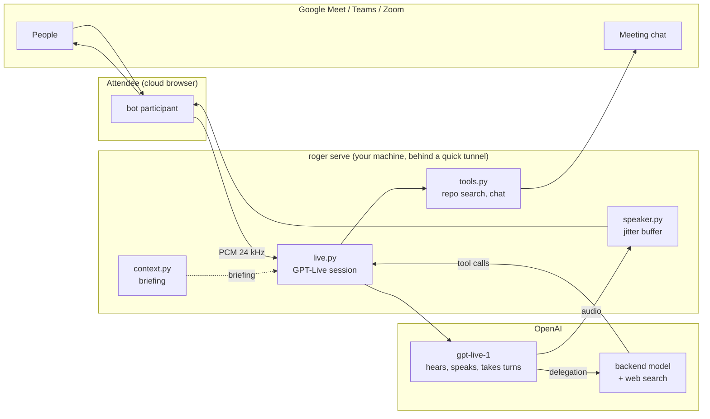

# Architecture

Roger is about 2,500 lines of Python. This is what they do and why.

## The shape of it

## One session does the hard part

A voice assistant is usually a chain: transcribe, decide whose turn it is, think, synthesise speech. Every
stage adds latency and a failure mode, and turn-taking is the one nobody gets right.

[GPT-Live](https://developers.openai.com/api/docs/guides/live) collapses the chain. One WebSocket carries
audio both ways; the model listens while it speaks, so interruption is native rather than simulated with
voice-activity heuristics. `roger/live.py` is that connection and nothing else: session setup, audio
framing, transcript reassembly, the delegation protocol.

## Thinking is delegated, not chained

When the model needs a fact it does not stop talking. It raises a *delegation*, and OpenAI runs a backend
model — passing it the conversation — while the voice keeps going. The result comes back and gets spoken
in the model's own words. A ten-second lookup sounds like a colleague thinking rather than dead air.

Roger uses **Responses delegation**, where OpenAI owns that loop. The alternative, client delegation, hands
you a delegation id and nothing else: you must reconstruct the question from the transcript, and a
transcript turn often closes *after* the delegation fires, so you answer the wrong question. That bug is
structurally impossible here.

Roger's own tools arrive as `response.event` envelopes, run in-process, and return through
`response.item.create`. They can search and read files under `PROJECT_DIR`, and post to the meeting chat.
Nothing writes, runs or pushes.

## Context comes from sessions, read not run

The briefing is what makes the bot worth talking to, and it comes from the coding sessions you were
already working in. `roger/sessions.py` finds and parses them — Claude Code's
`~/.claude/projects/**/<id>.jsonl` and Codex's `~/.codex/sessions/**/rollout-*.jsonl` — and
`roger/context.py` turns them, plus the repository, into a briefing with one OpenAI call.

Neither client is ever executed. They are transcripts on disk; treating them as anything more would mean a
second vendor, a second bill, and write access to sessions you are still using.

## Audio is the fiddly part

`roger/speaker.py` exists because GPT-Live streams at real time — about a second of audio per second — and
delivery stalls for up to ~360 ms. A text-to-speech API returns a whole sentence faster than you can say
it, so the far end always had slack; here it has none, and a stall mid-word is heard as distortion.

So output is buffered and *paced*: hold `OUTPUT_BUFFER_MS` of **speech** (silence does not count, and
counting it was a real bug), release it, then emit at a steady 100 ms cadence so bursty input leaves as an
even stream. Everything runs at 24 kHz, GPT-Live's native rate and the one Attendee wants for an OpenAI
voice, so no sample is resampled anywhere in the path.

## What is deliberately absent

- **No turn-taking classifier.** An earlier version ran a small model on every utterance to decide whether
  the bot was addressed. Across live meetings it judged 110 times and intervened zero times. The
  conversation prompt does this job; the classifier only cost latency and money. What remains is
  `roger/manners.py`: holding on *"hold on, Roger"*, which must work every time and so is plain regex.
- **No second agent framework.** GPT-Live's delegation *is* the agent loop.
- **No webcam.** It was an animated orb. It looked good and did nothing.

## Modules

| | |
|---|---|
| `cli.py` | the `roger` command, and `doctor` |
| `config.py` | every setting, read from the environment |
| `server.py` | aiohttp app, the Attendee WebSocket, the quick tunnel |
| `bridge.py` | the orchestrator: audio in, tools out, speaker attribution |
| `live.py` | the GPT-Live session and its protocol |
| `speaker.py` | paced, buffered audio back to the meeting |
| `attendee.py` | the meeting-bot API client |
| `context.py`, `sessions.py` | finding, reading and summarising coding sessions |
| `tools.py` | read-only repository search, and the meeting chat |
| `prompts.py` | every prompt, in one place |
| `manners.py` | holding |
| `audio.py`, `transcript.py` | PCM helpers, the meeting transcript |
